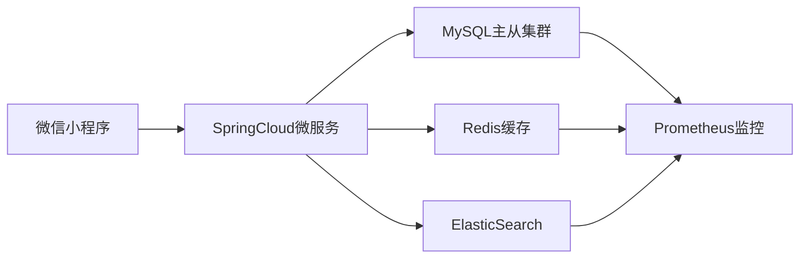

# 微信购物小程序🛒

[](https://opensource.org/licenses/MIT)
[](https://spring.io/projects/spring-boot)


这是一个全栈式电商解决方案，包含微信小程序前端和Spring Boot后端，支持完整的O2O购物流程。

## 📱 功能概览

| 模块         | 功能清单                                                     |
| ------------ | ------------------------------------------------------------ |
| **用户系统** | 微信一键登录、JWT Token鉴权、个人信息管理                    |
| **商品系统** | 多级分类展示、全文检索、商品详情页、热销榜单                 |
| **交易系统** | 购物车增删改查、订单创建、模拟支付（支持退款）、订单状态机管理 |
| **运营系统** | 首页轮播推荐、限时秒杀专区（需后端配合）、优惠券逻辑（开发中） |
| **后台管理** | 商品CRUD、订单查询、用户数据统计（预留管理端接口）           |

## 🛠 技术架构



### 技术选型

**前端技术栈**：
- 微信小程序原生开发
 select  * from sys_user;
- WXML+WXSS+JavaScript
- Vant Weapp UI组件库
- WXS高性能渲染

**后端技术栈**：
- Spring Boot 2.7.0
- Spring Security + JWT
- MyBatis-Plus 3.5.1
- Lombok
- Swagger 3.0
- Hutool工具集
- Redis + Redisson分布式锁
- MySQL 8.0 + ShardingSphere分库分表

## 📁 项目结构

### 前端目录

```
wechat-miniprogram/
├── app.js               # 全局入口
├── config/              # 环境配置
│   ├── dev.js
│   └── prod.js
├── components/          # 公共组件
├── assets/              # 静态资源
│   ├── icons/           # 矢量图标
│   └── images/          # 图片资源
├── services/            # 服务层
│   ├── api.js           # 接口集合
│   └── http.js          # 请求拦截器
└── pages/               # 业务页面
    ├── product/         # 商品模块
    ├── cart/            # 购物车模块
    └── order/           # 订单模块
```

### 后端目录

```
src/main/java/com/shop/
├── annotation/          # 自定义注解
├── aspect/              # AOP切面
├── config/              # 配置中心
├── controller/          # 控制层
├── dao/                 # 数据访问层
├── dto/                 # 数据传输对象
├── entity/              # 实体类
├── enums/               # 枚举定义
├── exception/           # 异常处理
├── interceptor/         # 拦截器
├── listener/            # 应用监听
├── service/             # 服务接口
├── task/                # 定时任务
└── utils/               # 工具包集合
```

## 🚀 快速启动

### 先决条件

- JDK 11+
- MySQL 8.x with InnoDB
- Redis 6.x
- Maven 3.6+
- 微信开发者工具（最新版本）

### 后端部署

1. 初始化数据库

```sql
CREATE DATABASE `shop` DEFAULT CHARACTER SET utf8mb4 COLLATE utf8mb4_unicode_ci;
USE shop;
SOURCE init.sql; # 您需要提供的数据库初始化脚本
```

2. 配置应用参数

`application-prod.yml`
```yaml
spring:
  datasource:
    url: jdbc:mysql://localhost:3306/shop?useSSL=false
    username: root
    password: your_secure_password
  redis:
    host: 127.0.0.1
    port: 6379
    password: 
```

3. 构建与运行

```bash
mvn clean package -DskipTests
java -jar target/wechat-shop.jar --spring.profiles.active=prod
```

### 前端配置

1. 修改 `config/prod.js`
```javascript
module.exports = {
  baseURL: 'https://your.domain.com/api',
  appId: 'wxxxxxxx' // 微信开放平台APPID
}
```

2. 在微信开发者工具中：
   - 导入本项目
   - 设置 -> 项目设置 -> 不校验合法域名（仅测试环境）
   - 点击 "编译" 按钮生成体验版

## 📚 API文档

访问Swagger UI界面（开发环境）：
```
http://localhost:8080/swagger-ui/
```

核心接口列表：
```
[POST] /api/auth/login       微信登录
[GET]  /api/products         商品分页查询
[POST] /api/cart/add         添加购物车
[POST] /api/order/create     创建订单
[POST] /api/pay/simulation   模拟支付
```

## 🔍 深入开发

### 配置微信支付

1. 在 `WxPayConfig` 类中配置商户信息：
```java
@Configuration
public class WxPayConfig {
    @Value("${wx.pay.app-id}") 
    private String appId;
  
    @Bean
    public WxPayService wxPayService() {
        // 初始化支付服务...
    }
}
```

### 性能调优建议

1. 启用二级缓存：
```xml
<!-- mybatis-config.xml -->
<settings>
    <setting name="cacheEnabled" value="true"/>
</settings>
```

2. 开启GZIP压缩：
```yaml
server:
  compression:
    enabled: true
    mime-types: text/html,text/xml,text/plain,application/json
```

## 🤝 开发协作

欢迎通过 Issue 提交问题或建议，遵循以下流程参与贡献：
1. Fork 本仓库
2. 创建特性分支 (`git checkout -b feature/AmazingFeature`)
3. 提交代码变更 (`git commit -m 'Add some AmazingFeature'`)
4. 推送至远程仓库 (`git push origin feature/AmazingFeature`)
5. 发起 Pull Request

## 📜 版权声明

本项目基于 MIT 许可证授权 - 详情请参阅 [LICENSE](LICENSE) 文件
